# Project Architecture: CNN Food Weight Prediction

This document describes the layer-by-layer architecture of the Convolutional Neural Networks used in this project, ranging from the production-level **EfficientNet-B0** to the simplified **Manual Manualization** model.

## 1. Visual Neural Network Architecture

This diagram shows the complete mathematical path of your data, from the raw **4x4 Input** to the final **Food Weight Prediction**.

```mermaid
graph LR
    %% ---------------------------------------------------------
    %% LAYER 1: 4x4 INPUT
    %% ---------------------------------------------------------
    subgraph "1. Input (4x4)"
        X1((X))
        X2((X))
        X3((X))
        X4((X))
        X_DOTS[...]
    end

    %% ---------------------------------------------------------
    %% LAYER 2: CONVOLUTION (3x3 Kernel)
    %% ---------------------------------------------------------
    subgraph "2. Conv Layers"
        C1((C1))
        C2((C2))
        C_GAP1[ ]
        C3((C3))
        C4((C4))
    end

    %% ---------------------------------------------------------
    %% LAYER 3: ACTIVATION (ReLU)
    %% ---------------------------------------------------------
    subgraph "3. Activation"
        A1((A1))
        A2((A2))
        A_GAP1[ ]
        A3((A3))
        A4((A4))
    end

    %% ---------------------------------------------------------
    %% LAYER 4: FLATTENING
    %% ---------------------------------------------------------
    subgraph "4. Flatten"
        F1((F1))
        F2((F2))
        F3((F3))
        F4((F4))
    end

    %% ---------------------------------------------------------
    %% LAYER 5: DENSE LAYER
    %% ---------------------------------------------------------
    subgraph "5. Dense"
        D1((D1))
        D2((D2))
    end

    %% ---------------------------------------------------------
    %% LAYER 6: OUTPUT
    %% ---------------------------------------------------------
    subgraph "6. Output"
        Y((Weight))
    end

    %% CONNECTIONS
    %% X to Conv (Local Connectivity)
    X1 --- C1
    X2 --- C1
    X3 --- C2
    X4 --- C2
    X_DOTS --- C3
    X_DOTS --- C4

    %% Conv to Activation (1-to-1)
    C1 --- A1
    C2 --- A2
    C3 --- A3
    C4 --- A4

    %% Activation to Flatten (1-to-1)
    A1 --- F1
    A2 --- F2
    A3 --- F3
    A4 --- F4

    %% Flatten to Dense (Fully Connected)
    F1 --- D1
    F1 --- D2
    F2 --- D1
    F2 --- D2
    F3 --- D1
    F3 --- D2
    F4 --- D1
    F4 --- D2

    %% Dense to Output
    D1 --- Y
    D2 --- Y

    %% STYLING
    style X1 fill:#888,stroke:#fff
    style X2 fill:#888,stroke:#fff
    style X3 fill:#888,stroke:#fff
    style X4 fill:#888,stroke:#fff
    
    style C1 fill:#666,stroke:#fff
    style C2 fill:#666,stroke:#fff
    style C3 fill:#666,stroke:#fff
    style C4 fill:#666,stroke:#fff
    
    style A1 fill:#444,stroke:#00FF88
    style A2 fill:#444,stroke:#00FF88
    style A3 fill:#444,stroke:#00FF88
    style A4 fill:#444,stroke:#00FF88

    style F1 fill:#333,stroke:#fff
    style F2 fill:#333,stroke:#fff
    style F3 fill:#333,stroke:#fff
    style F4 fill:#333,stroke:#fff

    style D1 fill:#222,stroke:#fff
    style D2 fill:#222,stroke:#fff

    style Y fill:#fff,stroke:#000,stroke-width:3px
    style X_DOTS fill:none,stroke:none
    style C_GAP1 fill:none,stroke:none
    style A_GAP1 fill:none,stroke:none

    linkStyle default stroke:#00FF88,stroke-width:1px
```

## 2. High-Level Pipeline
The system follows a sequential pipeline to process food images and predict their weight:
1.  **Segmentation (U-Net):** Isolates the food from the plate/background.
2.  **Preprocessing:** Resizes images to $224 \times 224$ and normalizes pixels to $[0, 1]$.
3.  **Feature Extraction:** uses the EfficientNet-B0 backbone.
4.  **Regression Head:** Converts high-level features into a final weight prediction (grams).

---

## 2. Production Architecture (EfficientNet-B0)
The production model is based on **EfficientNet-B0**, which uses Compound Scaling to balance depth, width, and resolution.

### Layer-by-Layer Breakdown:
| Stage | Operation | Input Resolution | Output Channels | Details |
| :--- | :--- | :--- | :--- | :--- |
| **Stem** | Conv 3x3 | $224 \times 224$ | 32 | Stride 2, Padding 1 |
| **Stage 1** | MBConv1, k3x3 | $112 \times 112$ | 16 | 1 Block |
| **Stage 2** | MBConv6, k3x3 | $112 \times 112$ | 24 | 2 Blocks, Stride 2 |
| **Stage 3** | MBConv6, k5x5 | $56 \times 56$ | 40 | 2 Blocks, Stride 2 |
| **Stage 4** | MBConv6, k3x3 | $28 \times 28$ | 80 | 3 Blocks, Stride 2 |
| **Stage 5** | MBConv6, k5x5 | $14 \times 14$ | 112 | 3 Blocks |
| **Stage 6** | MBConv6, k5x5 | $14 \times 14$ | 192 | 4 Blocks, Stride 2 |
| **Stage 7** | MBConv6, k3x3 | $7 \times 7$   | 320 | 1 Block |
| **Head** | Conv 1x1 & Pool| $7 \times 7$   | 1280 | Flattening occurs here |
| **Final** | Fully Connected| 1280 | 1 (Weight) | Output: Food Weight (g) |

> [!NOTE]
> **MBConv** blocks include Squeeze-and-Excitation (SE) and Swish activation functions, which are more advanced versions of the logic used in our manual model.

---

## 3. Manual Architecture (Excel Manualization)
This "Mini-CNN" is used for educational purposes to understand the underlying mathematics of the larger model.

### Layer-by-Layer Breakdown:
| Layer | Operation | Dimensions | Details |
| :--- | :--- | :--- | :--- |
| **Input** | Raw Data | $4 \times 4$ | Scaled pixel values (0 to 1) |
| **Conv 1** | Convolution | $2 \times 2$ | Uses 3x3 Kernels ($K_1, K_2$) |
| **Activation**| ReLU | $2 \times 2$ | `MAX(0, x)` |
| **Flatten** | Reshape | $1 \times 4$ | Unrolls matrix into a column |
| **Dense** | Linear | 1 | `(Features * Weights) + Bias` |
| **Output** | Prediction | 1 | Final result in Grams (g) |

---

## 4. Mathematical Summary
*   **Convolution:** $O = (X * K) + b$
*   **Feature Map:** The result of one kernel sliding over the input.
*   **Loss Function (MSE):** $L = (Y_{true} - Y_{pred})^2$. This is the "Teacher" that tells the architecture how to adjust its weights.

---

## 5. File References
*   **Core Implementation:** `source/helpers/efficientnet_b0.py`
*   **Regression Step:** `source/modules/step5_regression.py`
*   **Manualization Flow:** `docs/training_flowchart.md`
