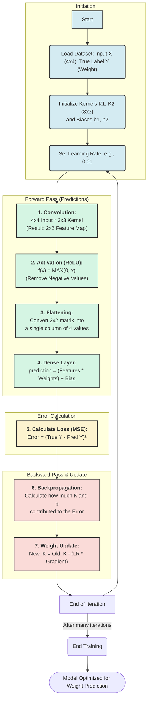

# Neural Network Training Flowchart for Excel Manualization

This document provides a visual flowchart of the mathematical training process for a neural network. This process is designed to be replicated step-by-step in an Excel spreadsheet to manually trace how the model learns.

## 1. Training Process Flowchart

## 2. Step-by-Step for your Excel Sheet

### Step 1: Initialization
*   **Input ($X$):** $4 \times 4$ matrix. Normalize values between 0.0 and 1.0 (Pixel / 255).
*   **Kernel ($K$):** $3 \times 3$ matrix with small random numbers ($ -0.2$ to $0.2$).
*   **Bias ($b$):** Start with 0.

### Step 2: Convolution (Forward Pass)
*   **Formula:** `=SUMPRODUCT(Input_Slice, $Kernel) + $Bias`
*   Create a **$2 \times 2$** output area for each kernel ($K_1, K_2$).

### Step 3: Activation (ReLU)
*   **Formula:** `=MAX(0, Conv_Output_Cell)`
*   This makes the model "Non-Linear" and is essential for learning.

### Step 4: Flattening & Dense Layer
*   Copy your $2 \times 2$ results into a single column (4 rows).
*   Multiply these 4 numbers by 4 "Dense Weights" using `=SUMPRODUCT()` to get your final predicted weight.

### Step 5: Loss Calculation
*   **Formula:** `=(Actual_Weight - Predicted_Weight)^2`
*   Your goal is to make this number as small as possible in the next step!

### Step 6: Backpropagation (The "Training")
*   This is where you adjust your $K$ and $b$ values based on the Error. In Excel, you can use **"Solver"** or manual derivatives to see how changing a kernel value drops the Loss.
